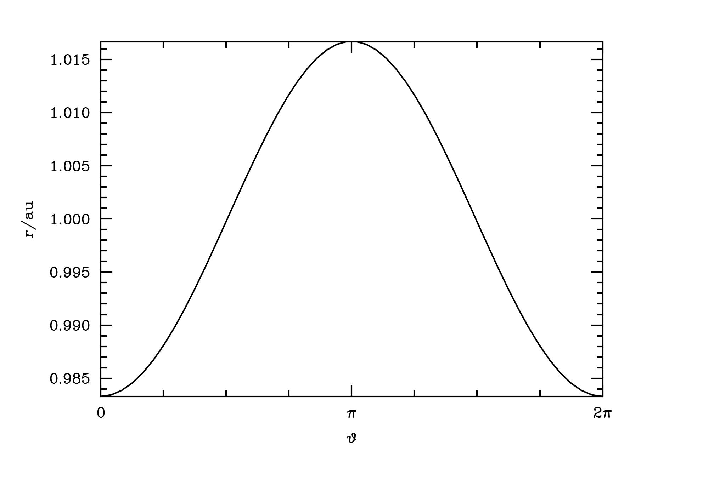

.. _keplerian_system:

*******************************
Representing a Keplerian system
*******************************

To a good approximation the Earth--Sun system is Keplerian. The Earth moves on an elliptical orbit with semimajor axis :math:`a = 1~\text{au}` and ellipticity :math:`e = 0.0167` in the gravitational central potential generated by the Sun, which has mass :math:`m = \text{M}_{\odot}`. We may represent this system in Dyad using the class :class:`dyad.Orbit`.

.. doctest:: python

   >>> import dyad
   >>> m, a, e = 1., 1., 0.0167
   >>> orbit = dyad.Orbit(m, a, e)

This instance of the class :class:`dyad.Orbit` has a number of
attributes that we may interrogate. They include the periapsis and
apoapsis. A full list is available in the API documentation.

.. doctest:: python

   >>> orbit.periapsis
   np.float64(0.9833)
   >>> orbit.apoapsis
   np.float64(1.0167)

The state of the body is specified by its true anomaly,
:math:`\theta`. Suppose that :math:`\theta = 1`. Then we may compute
various properties of this state using the methods of
:class:`dyad.Orbit`. These include the radius, speed, and dynamical
state. Again, a full list is available in the API documentation.

.. doctest:: python

   >>> theta = 1.
   >>> orbit.radius(theta)
   np.float64(0.9907812427855317)
   >>> orbit.speed(theta)
   np.float64(30.06054704930534)
   >>> orbit.state(theta)
   array([  0.53532139,   0.83371367,   0.        , -25.0664496 ,
	   16.59245592,   0.        ])

If the observer's frame differs from the perifocal frame we may
specify its orientation using the Euler angles :math:`\Omega`,
:math:`i`, and :math:`\omega` (longitude of the ascending node,
inclination, and argument of pericentre). Suppose that :math:`\Omega =
1`, :math:`i = 1`, and :math:`\omega = 1`.

.. doctest:: python

   >>> Omega, i, omega = 1., 1., 1.
   >>> orbit = dyad.Orbit(m, a, e, Omega, i, omega)

All attributes and methods are available as before.

To plot the evolution in time of any quantity sample the mean anomaly
uniformly on the interval :math:`[0, 2\pi)` and convert it to true
anomaly. Consider, for example, the evolution of the orbital radius.

.. doctest:: python

   >>> import numpy as np
   >>> mu = np.linspace(0., 2.*np.pi)
   >>> theta = dyad.true_anomaly_from_mean_anomaly(mu, e)
   >>> r = orbit.radius(theta)

Plot this.

.. doctest:: python

   >>> import matplotlib.pyplot as plt
   >>> fig, ax = plt.subplots()
   >>> ax.plot(theta, r)
   [<matplotlib.lines.Line2D object at 0x744af577ada0>]
   >>> ax.set_xticks([0., np.pi, 2.*np.pi], [r"$0$", r"$\pi$", r"$2\pi$"])
   >>> ax.set_xlabel(r"$\theta$")
   Text(0.5, 0, '$\\theta$')
   >>> ax.set_ylabel(r"$r/\mathrm{au}$")
   Text(0, 0.5, '$r/\\mathrm{au}$')
   >>> plt.show()

.. _radius:

   The evolution of the Earth's radius over the course of a year.
   
.. _binary_system:

****************************
Representing a binary system
****************************

To a good approximation the Alpha Centauri A--B system is an isolated
binary. The two component stars have masses :math:`M_{A} =
1.0790~\text{M}_{\odot}` and :math:`M_{B} = 0.9092~\text{M}_{\odot}`,
so that the mass ratio is :math:`q = 0.8428`. Both stars move on
elliptical orbits with eccentricity :math:`e = 0.5195`. The semimajor
axis of the primary star's orbit is :math:`a_{A} =
10.60~\text{au}`. We may represent this system using the class
:class:`dyad.TwoBody`.

.. doctest:: python

   >>> import dyad
   >>> m_A, q, a_A, e = 1.079, 0.8428, 10.60, 0.5195
   >>> binary = dyad.TwoBody(m_A, q, a_A, e)

The properties of the primary and secondary orbits are available using
the instance attributes `primary` and `secondary`, which are each
instances of the class :class:`dyad.Orbit`. All attributes of these
instances are available as before (:ref:`keplerian_system`). For
example, we may wish to know the orbital radii at the periapses of the
two orbits.
   
.. doctest:: python

   >>> binary.primary.periapsis
   np.float64(5.0933)
   >>> binary.secondary.periapsis
   np.float64(6.0433080208827725)

Equivalently, we might compute these values as follows.

.. doctest:: python

   >>> binary.primary.radius(0.)
   np.float64(5.093300000000001)
   >>> binary.secondary.radius(0.)
   np.float64(6.043308020882773)

Note that all properties of the primary and secondary orbits are
computed in the observer's frame, with the origin at the primary focus.
