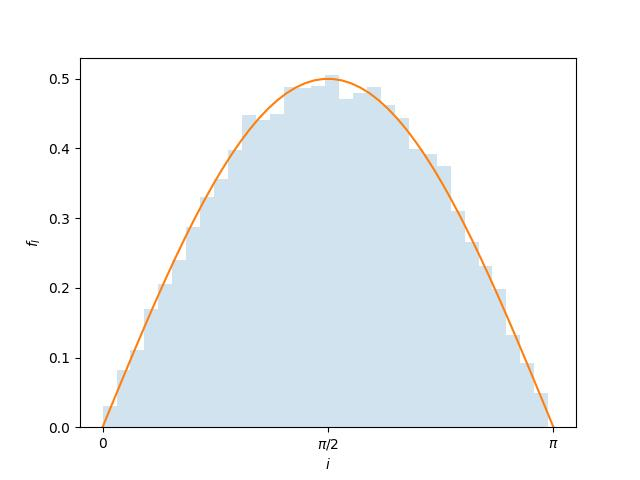
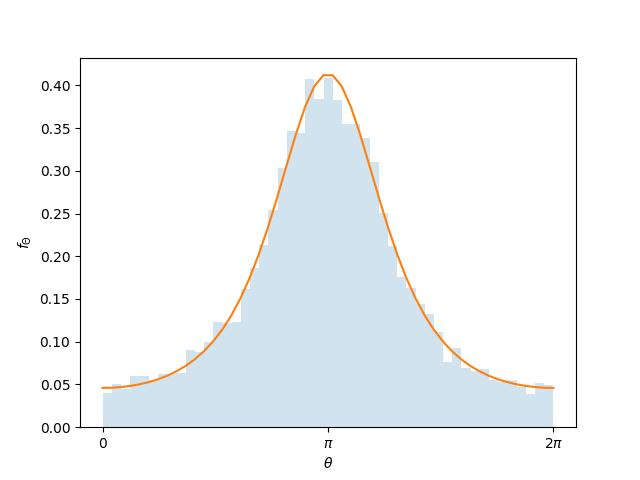

.. _tutorial_2:

*****************************************
Synthesizing a population of binary stars
*****************************************

Dyad has a subpackage, :mod:`dyad.stats`, that contains probability
distributions for the masses, mass ratios, and orbital elements of a
population of binary stars. These probability distributions are
implemented in the same way as Scipy's continous random variables (see
:class:`scipy.stats.rv_continuous` and, for an example,
:class:`scipy.stats.loguniform`). As a result, they come equipped with
a large number of useful methods, in particular ``pdf``, which
computes the probability density function (PDF), and ``rvs``, which
generates random variates (i.e. which generates a sample).

For example, consider the random variable for inclination, :math:`I`, where :math:`\cos(I) \sim U(-1, 1)`. This is implemented by Dyad using the class :class:`dyad.stats.inclination`. Instantiate this class as follows.

.. doctest:: python

   >>> import dyad
   >>> rv = dyad.stats.inclination

Now compute the PDF on the interval :math:`[0, \pi]`.

.. doctest:: python

   >>> import numpy as np
   >>> x = np.linspace(0., np.pi)
   >>> pdf = rv.pdf(x)

And generate a sample of size :math:`10\,000`.

.. doctest:: python

   >>> sample = rv.rvs(size=10_000)

Now plot our results.

.. doctest:: python

   >>> import matplotlib.pyplot as plt
   >>> fig, ax = plt.subplots()
   >>> ax.hist(sample, bins="auto", density=True, histtype="stepfilled", alpha=0.2)
   >>> ax.set_xticks([0., 0.5*np.pi, np.pi], [r"$0$", r"$\pi/2$", r"$\pi$"])
   >>> ax.set_xlabel(r"$i$")
   Text(0.5, 0, '$i$')
   >>> ax.set_ylabel(r"$f_{I}$")
   Text(0, 0.5, '$f_{I}$')
   >>> ax.plot(x, pdf)
   >>> plt.show()

.. _inclination:

   The probability density function for inclination.

Some of Dyad's random variables are dependent on other random variables. We must use their shape parameters to fully specify them. For example, the true anomaly of a body moving on an elliptical orbit in a gravitational central potential depends on that orbit's eccentricity, so we are interested in the conditional distribution of :math:`\Theta` given :math:`E`. Again, we may synthesize a sample and compute the PDF. Suppose that :math:`e = 0.5`.

.. doctest:: python

   >>> rv = dyad.stats.true_anomaly(e=0.5)
   >>> x = np.linspace(0., 2.*np.pi)
   >>> pdf = rv.pdf(x)
   >>> sample = rv.rvs(size=10_000)

Then plot the results.

.. doctest:: python

   >>> fig, ax = plt.subplots()
   >>> ax.hist(sample, bins="auto", density=True, histtype="stepfilled", alpha=0.2)
   >>> ax.plot(x, pdf)
   >>> ax.set_xticks([0., np.pi, 2.*np.pi], [r"$0$", r"$\pi$", r"$2\pi$"])
   >>> ax.set_xlabel(r"$\theta$")
   Text(0.5, 0, '$\\theta$')
   >>> ax.set_ylabel(r"$f_{\Theta}$")
   Text(0, 0.5, '$f_{\\Theta}$')
   >>> plt.show()

.. _inclincation:

   The probability density function for true anomaly.

In some cases there is a choice of distribution. These are kept in the
submodules :mod:`dyad.stats.eccentricity`, :mod:`dyad.stats.period`,
:mod:`dyad.stats.log_period`, :mod:`dyad.stats.mass`,
:mod:`dyad.stats.mass_ratio`, :mod:`dyad.stats.semimajor_axis`. For
example, when considering the eccentricity of an orbit we may wish to
use a thermal distribution.

.. doctest:: python

   >>> rv = dyad.stats.eccentricity.thermal

Its methods are available in the same way as before.

.. doctest:: python

   >>> x = np.linspace(0., 1.)
   >>> rv.pdf(x)
   array([0.        , 0.04081633, 0.08163265, 0.12244898, 0.16326531,
	  0.20408163, 0.24489796, 0.28571429, 0.32653061, 0.36734694,
	  0.40816327, 0.44897959, 0.48979592, 0.53061224, 0.57142857,
	  0.6122449 , 0.65306122, 0.69387755, 0.73469388, 0.7755102 ,
	  0.81632653, 0.85714286, 0.89795918, 0.93877551, 0.97959184,
	  1.02040816, 1.06122449, 1.10204082, 1.14285714, 1.18367347,
	  1.2244898 , 1.26530612, 1.30612245, 1.34693878, 1.3877551 ,
	  1.42857143, 1.46938776, 1.51020408, 1.55102041, 1.59183673,
	  1.63265306, 1.67346939, 1.71428571, 1.75510204, 1.79591837,
	  1.83673469, 1.87755102, 1.91836735, 1.95918367, 2.        ])
   
A complete population
=====================

Let us synthesize the complete orbital properties of a population of binary stars, namely the mass, mass ratio, and orbital elements.
These have been determined for binary systems with sun-like primary stars in the solar neighbourhood by Duquennoy and Mayor [DM91]_.
According to Duquennoy and Mayor the mass ratio and period (which we may convert to semimajor axis) are independent of all other properties while the eccentricity is dependent on period.
A system with period no longer than the circularization period of :math:`11.6~\text{d}` has vanishing eccentricity.
Only a system with a period longer than this has an eccentricity that may be treated as a random variable.
However, that random variable is itself dependent on period.

Dyad uses the distributions published by Duquennoy and Mayor to implement the random variables
:class:`dyad.stats.mass_ratio.duquennoy1991`,
:class:`dyad.stats.log_period.duquennoy1991`, and 
:class:`dyad.stats.eccentricity.duquennoy1991`.
Since eccentricity is dependent on period we must use its shape parameter, ``period``, to fully specify it.
Recall that Dyad uses the day as the unit of time meaning that the unit of period is :math:`\mathrm{d}^{-1}`.

The primary stars in question have primary masses of :math:`M_{1}/\text{M}_{\odot} \in [0.9, 1.2]` but the distributions of Duquennoy and Mayor are frequently assumed to hold for systems with red-giant primary stars, which have masses of :math:`0.8~\mathrm{M}_{\odot}`.
Let us sample the mass ratio and the period for such a population.

.. doctest:: python

   >>> n = 10_000
   >>> m_1 = np.full((n,), 0.8)
   >>> q = dyad.stats.mass_ratio.duquennoy1991.rvs(size=n)
   >>> p = 10.**dyad.stats.log_period.duquennoy1991.rvs(size=n)

Now sample the eccentricity, remembering that the circularization period is :math:`11.6~\mathrm{day}`. 

.. doctest:: python
		
   >>> e = np.zeros(n)
   >>> e[p > 11.6] = dyad.stats.eccentricity.duquennoy1991(p[p > 11.6]).rvs()

Using these eccentricities sample the true anomaly.

.. doctest:: python

   >>> theta = dyad.stats.true_anomaly(e).rvs()

Note that, since the eccentricities are all different, we do not pass a size argument to the method ``rvs``. Now sample the orientation of the system.

.. doctest:: python

   >>> Omega = dyad.stats.longitude_of_ascending_node.rvs(size=n)
   >>> i = dyad.stats.inclination.rvs(size=n)
   >>> omega = dyad.stats.argument_of_pericentre().rvs(size=n)

The class :class:`dyad.TwoBody` can serve as a container for these values. First convert the periods to their equivalent primary-star semimajor axes.

.. doctest:: python

   >>> a = dyad.semimajor_axis_from_period(p, m_1, m_1*q)
   >>> a_1 = dyad.primary_semimajor_axis_from_semimajor_axis(a, q)

Then instantiate a :class:`dyad.TwoBody` object.

.. doctest:: python

   >>> binary = dyad.TwoBody(m_1, q, a_1, e, Omega, i, omega)

We can now access the methods and attributes of `binary.primary` and `binary.secondary`. For example, their states.

.. doctest:: python

   >>> binary.primary.state(theta)
   array([[ 2.26244911e+00, -2.79113484e-01,  2.41325118e+00,
	   -1.60180500e+00,  2.24061375e+00, -8.98379371e+00],
	  [ 8.45115147e-01,  3.45083123e+00, -6.94234908e-01,
	    5.53497579e-01, -1.34730654e+00,  2.30173200e-01],
	  [ 2.93042925e-01, -4.76899811e-01, -4.23829656e-01,
	    3.31172050e+00, -2.10101490e+00, -6.25524573e+00],
	  ...,
	  [-7.30820917e-01, -1.27317250e+00, -1.48355811e+00,
	   -2.23831786e+00, -1.29929711e+00,  1.81520746e-01],
	  [ 8.36627923e+02, -1.49819623e+03, -1.44944088e+03,
	   -1.38873199e-02,  3.41546208e-03, -6.85223876e-03],
	  [ 2.12439658e-01,  5.12672522e-02,  3.57926907e-01,
	    1.15849143e+01, -8.81727542e+00, -2.50684256e+00]],
	 shape=(10000, 6))
   >>> binary.secondary.state(theta)
   array([[-2.15041278e+00,  2.65291803e-01, -2.29374714e+00,
	    1.52248372e+00, -2.12965871e+00,  8.53891684e+00],
	  [-2.67551974e+00, -1.09248629e+01,  2.19785340e+00,
	   -1.75229814e+00,  4.26538946e+00, -7.28697081e-01],
	  [-6.20820688e-01,  1.01032731e+00,  8.97896509e-01,
	   -7.01598444e+00,  4.45106639e+00,  1.32519356e+01],
	  ...,
	  [ 1.96395846e+00,  3.42143724e+00,  3.98681323e+00,
	    6.01510327e+00,  3.49164275e+00, -4.87806513e-01],
	  [-5.19896923e+03,  9.31008383e+03,  9.00710857e+03,
	    8.62985168e-02, -2.12243481e-02,  4.25811493e-02],
	  [-2.94161057e-01, -7.09887656e-02, -4.95614417e-01,
	   -1.60414051e+01,  1.22091095e+01,  3.47117607e+00]],
	 shape=(10000, 6))

References
==========

.. [DM91]

   Duquennoy, A., and M. Mayor. 1991. \'Multiplicity among solar-type
   stars in the solar neighbourhood---II. Distribution of the orbital
   elements in an unbiased Sample\'. *Astronomy and Astrophysics* 248
   (August): 485.
