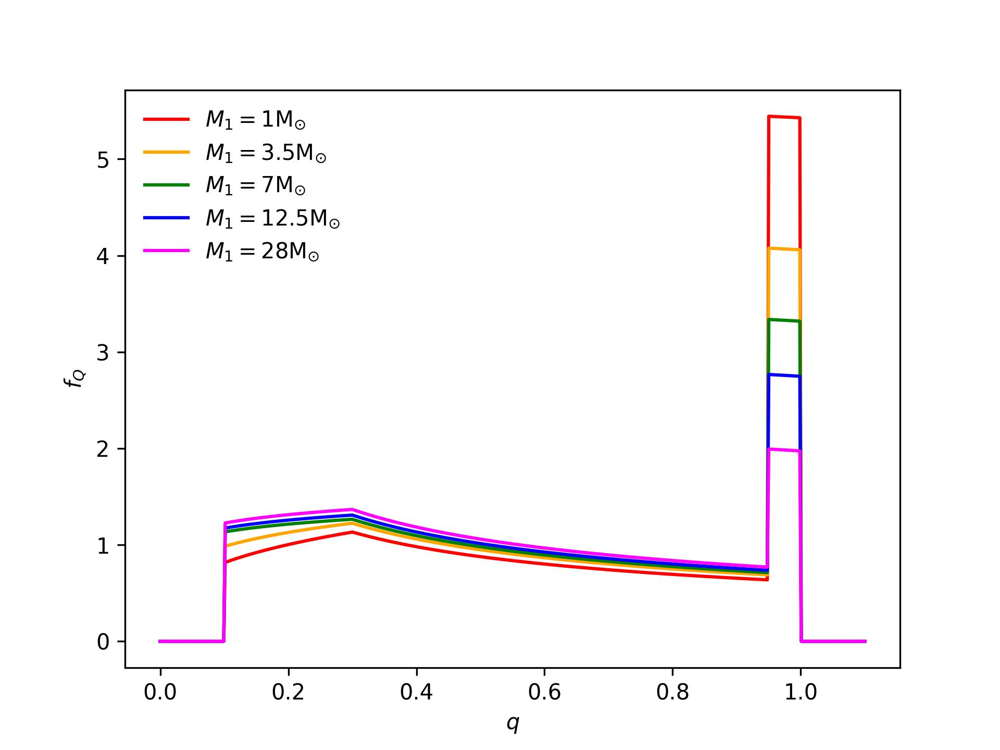
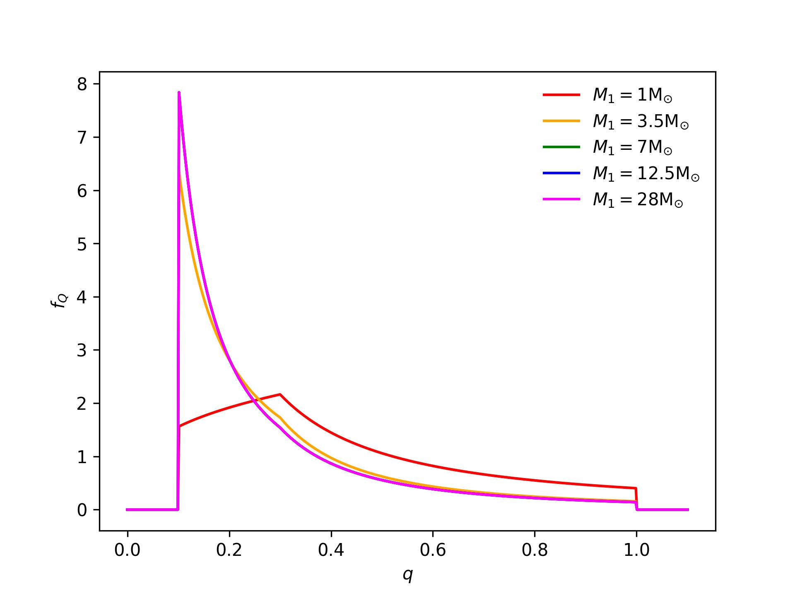
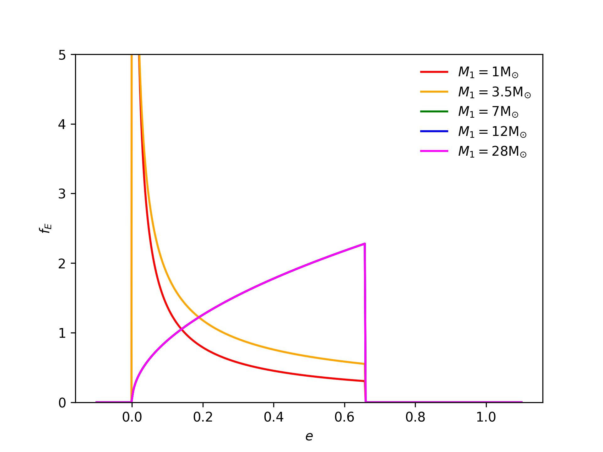
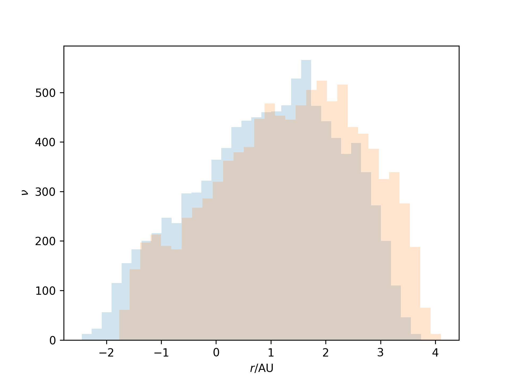
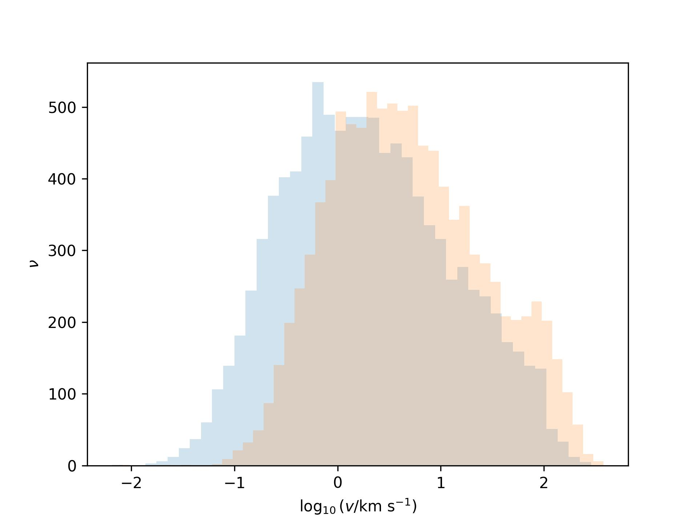

.. _tutorial_3:

*************************************
Zero-age main-sequence binary systems
*************************************

Moe and Di Stefano [MS17]_ reported empirical distributions for the period, :math:`P`, mass-ratio, :math:`Q`, and eccentricity, :math:`E`, of binary systems consisting of two zero-age main-sequence (ZAMS) stars with primaries of types O, B, A, F, and G, i.e. with primaries of mass :math:`M_{1}/\text{M}_{\odot} \in [0.8, 40]`. They determined these by compiling observations of binary systems in nearby open clusters and stellar associations as well as in volume-limited surveys of the solar neighbourhood.

They found that the period is dependent on primary mass while the mass ratio and eccentricity are dependent on both period and primary mass.
Alongside the empirical distributions Moe and Di Stefano gave formulae for the corresponding probability density functions, which Dyad uses to implement the random variables
:class:`dyad.stats.log_period.moe2017`,
:class:`dyad.stats.period.moe2017`,
:class:`dyad.stats.mass_ratio.moe2017`, and
:class:`dyad.stats.eccentricity.moe2017`.
Since these are dependent on other random variables we must use their shape parameters to fully specify them.
Recall that Dyad requires period to be specified in units of :math:`\mathrm{d}` and mass to be specified in units :math:`\mathrm{M}_{\odot}`.

The probability density functions
=================================

Let us plot the PDFs of each random variable in turn.
In each case we will consider the average primary mass for each spectral type considered by Moe and Di Stefano, namely :math:`m_{1}/\mathrm{M}_{\odot} = 1, 3.5, 7, 12.5, 28`, which we can specify now.

.. testsetup::

   import numpy as np
   np.random.seed(0)

.. doctest:: python

   >>> import numpy as np
   >>> m_1 = np.array([1., 3.5, 7., 12.5, 28.])

Log-period
----------

Let us evaluate the conditional PDF of log-period given primary mass, :math:`f_{\log_{10}(P)|M_{1}}`, which is nonzero between :math:`\log_{10}(P/\mathrm{d}) = 0.2` and :math:`\log_{10}(P/\mathrm{d}) = 8`
where :math:`M_{1}/\mathrm{M}_{\odot} \in [0.8, 40]`.
Dyad implements the log-period random variable using the class :class:`dyad.stats.log_period.moe2017`, which has shape parameter ``primary_mass``.

To allow for `broadcasting <https://numpy.org/doc/stable/user/basics.broadcasting.html>`_ we must increase the dimension of ``m_1`` using the notation ``m_1[:,None]`` to create a new axis.

.. doctest:: python

   >>> import dyad.stats as stats
   >>> log_p = np.linspace(-1., 9., 500)
   >>> f = stats.log_period.moe2017(m_1[:,None]).pdf(log_p)

Now let us plot these values.

.. doctest:: python

   >>> import matplotlib.pyplot as plt
   >>> label = [
   ...     r"$M_{1} = 1\mathrm{M}_{\odot}$",
   ...     r"$M_{1} = 3.5\mathrm{M}_{\odot}$",
   ...     r"$M_{1} = 7\mathrm{M}_{\odot}$",
   ...     r"$M_{1} = 12.5\mathrm{M}_{\odot}$",
   ...     r"$M_{1} = 28\mathrm{M}_{\odot}$"
   ... ]
   >>> color = ["red", "orange", "green", "blue", "magenta"]
   >>> fig, ax = plt.subplots()
   >>> for (f_i, label_i, color_i) in zip(f, label, color):
   ...     ax.plot(log_p, f_i, label=label_i, color=color_i)
   [<matplotlib.lines.Line2D object at 0x...>]
   [<matplotlib.lines.Line2D object at 0x...>]
   [<matplotlib.lines.Line2D object at 0x...>]
   [<matplotlib.lines.Line2D object at 0x...>]
   [<matplotlib.lines.Line2D object at 0x...>]
   >>> ax.legend(frameon=False)
   <matplotlib.legend.Legend object at 0x...>
   >>> ax.set_xlabel(r"$\log_{10}(p/\mathrm{d})$")
   Text(0.5, 0, '$\\log_{10}(p/\\mathrm{d})$')
   >>> ax.set_ylabel(r"$f_{log_{10}(P)}$")
   Text(0, 0.5, '$f_{log_{10}(P)}$')
   >>> plt.show()

.. _logperiod:
.. figure:: ../figures/moe2017_pdf_logperiod.jpg
   :figwidth: 75%
   :align: center

   The conditional PDF of log-period, :math:`\log_{10}(P)` given primary mass, :math:`M_{1}`.

We may also evaluate the conditional PDF of period (rather than log-period)  given primary mass, :math:`f_{P|M_{1}}`, which is nonzero between :math:`P/\mathrm{d} = 10^{0.2}` and :math:`P/\mathrm{d} = 10^{8}`
where :math:`M_{1}/\mathrm{M}_{\odot} \in [0.8, 40]`.

.. doctest:: python

   >>> p = np.logspace(-1., 9., 500)
   >>> f = stats.period.moe2017(m_1[:,None]).pdf(p)

Mass ratio
----------

Let us evaluate the conditional PDF of mass ratio given log-period and primary mass, :math:`f_{Q|\log_{10}(P), M_{1}}`, which is nonzero between :math:`q = 0.1` and :math:`q = 1`, where :math:`\log_{10}(P/\mathrm{d}) \in [0.2, 8]` and :math:`M_{1}/\mathrm{M}_{\odot} \in [0.8, 40]`.
Dyad implements the mass-ratio random variable using the class :class:`dyad.stats.mass_ratio.moe2017`, which has shape parameters ``log10_period`` and ``primary_mass``.

This PDF is qualitatively different for short- and long-period binary systems.
For short-period systems it is approximately constant except for an excess of twins, this excess being greater for systems with low-mass primary stars than it is for systems with high-mass primary stars.
For long-period systems with high-mass primary stars it is a decreasing function of :math:`q`.
For long-period systems with low-mass primary stars it has a mode at :math:`q = 0.3`.

Let us consider the minimum and maximum allowed log-periods, :math:`0.2` and :math:`8`.
First, the case of :math:`\log_{10}(P/\mathrm{d}) = 0.2`.

.. doctest:: python

   >>> q = np.linspace(0., 1.1, 500)
   >>> f = stats.mass_ratio.moe2017(0.2, m_1[:,None]).pdf(q)

Which we may plot.

.. doctest:: python

   >>> fig, ax = plt.subplots()
   >>> for (f_i, label_i, color_i) in zip(f, label, color):
   ...     ax.plot(q, f_i, label=label_i, color=color_i)
   [<matplotlib.lines.Line2D object at 0x...>]
   [<matplotlib.lines.Line2D object at 0x...>]
   [<matplotlib.lines.Line2D object at 0x...>]
   [<matplotlib.lines.Line2D object at 0x...>]
   [<matplotlib.lines.Line2D object at 0x...>]
   >>> ax.legend(frameon=False)
   <matplotlib.legend.Legend object at 0x...>
   >>> ax.set_xlabel(r"$q$")
   Text(0.5, 0, '$q$')
   >>> ax.set_ylabel(r"$f_Q$")
   Text(0, 0.5, '$f_Q$')
   >>> plt.show()

.. _mass_ratio_short_period:

   The PDF of mass ratio, :math:`Q`, given log-period, :math:`\log_{10}(P/\mathrm{d}) = 0.2` and primary mass :math:`M_{1}`.

Second, the case of :math:`\log_{10}(P/\mathrm{d}) = 8`.

.. doctest:: python

   >>> f = stats.mass_ratio.moe2017(8., m_1[:,None]).pdf(q)

Which we may again plot.

.. doctest:: python

   >>> fig, ax = plt.subplots()
   >>> for (f_i, label_i, color_i) in zip(f, label, color):
   ...     ax.plot(q, f_i, label=label_i, color=color_i)
   [<matplotlib.lines.Line2D object at 0x...>]
   [<matplotlib.lines.Line2D object at 0x...>]
   [<matplotlib.lines.Line2D object at 0x...>]
   [<matplotlib.lines.Line2D object at 0x...>]
   [<matplotlib.lines.Line2D object at 0x...>]
   >>> ax.legend(frameon=False)
   <matplotlib.legend.Legend object at 0x...>
   >>> ax.set_xlabel(r"$q$")
   Text(0.5, 0, '$q$')
   >>> ax.set_ylabel(r"$f_Q$")
   Text(0, 0.5, '$f_Q$')
   >>> plt.show()

.. _mass_ratio_long_period:

   The conditional PDF of mass ratio, :math:`Q`, given log-period, :math:`\log_{10}(P/\mathrm{d}) = 8` and primary mass :math:`M_{1}`.

Eccentricity
------------

Let us evaluate the conditional PDF of mass ratio given log-period and primary mass, :math:`f_{E|\log_{10}(P), M_{1}}`, which is nonzero between :math:`e = 0.` and :math:`e_{\max}`, where :math:`e_{\max}` is an increasing function of log-period and where :math:`\log_{10}(P/\mathrm{d}) \in [0.9375, 8]` and :math:`M_{1}/\mathrm{M}_{\odot} \in [0.8, 40]`.
Dyad implements the eccentricity random variable using the class :class:`dyad.stats.eccentricity.moe2017`, which has shape parameters ``log10_period`` and ``primary_mass``.
The minimum period is known as the \'circularization period\',
If a binary system has a period shorter than the circularization period then its eccentricity is zero.
Dyad uses a circularation period of :math:`0.9375`, which differs from the value of :math:`0.5` used by Moe and Di Stefano in order to ensure that the PDF always has finite integral.
For a full discussion, see the API documentation.

The PDF is qualitatively different for short- and long-period binary systems.
For short-period systems with small primary star masses it is a descreasing function of :math:`q`.
For short-period systems with large primary star masses it is an increasing function of :math:`q`.
For long-period systems it is also an increasing function of :math:`q`.

Let us consider the log-periods, :math:`\log_{10}(P/\mathrm{d}) = 1` and :math:`\log_{10}(P/\mathrm{d}) = 8`.
First, evaluate the PDF for :math:`\log_{10}(P/\mathrm{d}) = 1`.

.. doctest:: python

   >>> e = e = np.linspace(-0.1, 1.1, 500)
   >>> f = stats.eccentricity.moe2017(1., m_1[:,None]).pdf(e)

And plot it.

.. _eccentricity_short_period:

   The PDF of eccentricity, :math:`E`, given log-period, :math:`\log_{10}(P/\mathrm{d}) = 1` and primary mass, :math:`M_{1}`.

.. doctest:: python

   >>> fig, ax = plt.subplots()
   >>> for (f_i, label_i, color_i) in zip(f, label, color):
   ...     ax.plot(e, f_i, label=label_i, color=color_i)
   [<matplotlib.lines.Line2D object at 0x...>]
   [<matplotlib.lines.Line2D object at 0x...>]
   [<matplotlib.lines.Line2D object at 0x...>]
   [<matplotlib.lines.Line2D object at 0x...>]
   [<matplotlib.lines.Line2D object at 0x...>]
   >>> ax.legend(frameon=False)
   <matplotlib.legend.Legend object at 0x...>
   >>> ax.set_ylim(0., 5.)
   (0.0, 5.0)
   >>> ax.set_xlabel(r"$e$")
   Text(0.5, 0, '$e$')
   >>> ax.set_ylabel(r"$f_E$")
   Text(0, 0.5, '$f_E$')
   >>> plt.show()

Second, evaluate the PDF for :math:`\log_{10}(P/\mathrm{d}) = 8`.

.. doctest:: python

   >>> f = stats.eccentricity.moe2017(8., m_1[:,None]).pdf(e)

And again plot it.

.. doctest:: python

   >>> fig, ax = plt.subplots()
   >>> for (f_i, label_i, color_i) in zip(f, label, color):
   ...     ax.plot(e, f_i, label=label_i, color=color_i)
   [<matplotlib.lines.Line2D object at 0x...>]
   [<matplotlib.lines.Line2D object at 0x...>]
   [<matplotlib.lines.Line2D object at 0x...>]
   [<matplotlib.lines.Line2D object at 0x...>]
   [<matplotlib.lines.Line2D object at 0x...>]
   >>> ax.legend(frameon=False)
   <matplotlib.legend.Legend object at 0x...>
   >>> ax.set_xlabel(r"$e$")
   Text(0.5, 0, '$e$')
   >>> ax.set_ylabel(r"$f_E$")
   Text(0, 0.5, '$f_E$')
   >>> plt.show()

.. _eccentricity_long_period:
.. figure:: ../figures/moe2017_pdf_eccentricity_long_period.jpg
   :figwidth: 75%
   :align: center

   The PDF of eccentricity, :math:`E`, given log-period, :math:`\log_{10}(P/\mathrm{d}) = 8` and primary mass, :math:`M_{1}`.

A complete population
=====================

Let us now synthesize a population of ZAMS binary systems using the distributions of Moe and Di Stefano.
We will use the primary-constrained pairing method to synthesize the primary- and secondary-star masses [K09]_.
According to this method we synthesize the primary-star star mass assuming that it is distributed according to the initial mass function and then synthesize the secondary-star mass using the conditional distribution of secondary-star mass given primary-star mass.

First, specify a sample size.

.. doctest:: python

   >>> n_binary = 10_000

And sample the primary mass using a Salpeter random variable on the interval :math:`0.8, 40`. 

.. doctest:: python

   >>> m_1 = stats.mass.salpeter1955(0.8, 40.).rvs(size=n_binary)

Next sample the period.

.. doctest:: python

   >>> log_p = stats.log_period.moe2017(m_1).rvs()
   >>> p = 10.**log_p

And the mass ratio. (This can be time consuming. A sample of size :math:`100\,000` may take several minutes or more to be generated.)

.. doctest:: python

   >>> q = stats.mass_ratio.moe2017(log_p, m_1).rvs()

Now sample the eccentricity, remembering that all systems with periods shorter than the circularization period, when :math:`\log_{10}(P) = 0.9375`, have eccentricities of zero.

.. doctest:: python

   >>> e = np.zeros(n_binary)
   >>> idx = (log_p > 0.9375)
   >>> e[idx] = stats.eccentricity.moe2017(log_p[idx], m_1[idx]).rvs()

Finally, sample the longitude of the ascending node, inclination, and argument of periapsis.

.. doctest:: python

   >>> Omega = stats.longitude_of_ascending_node.rvs(size=n_binary)
   >>> i = stats.inclination.rvs(size=n_binary)
   >>> omega = stats.argument_of_pericentre.rvs(size=n_binary)

As before, the class :class:`dyad.TwoBody` can serve as a container for these values.
First convert the periods to their equivalent primary-star semimajor axes.

.. doctest:: python

   >>> import dyad
   >>> a = dyad.semimajor_axis_from_period(p, m_1, m_1*q)
   >>> a_1 = dyad.primary_semimajor_axis_from_semimajor_axis(a, q)

And instantiate a :class:`dyad.TwoBody` object.

.. doctest:: python

   >>> binary = dyad.TwoBody(m_1, q, a_1, e, Omega, i, omega)

Before, we inspected the state of a single member of this population for a given true anomaly.
This time, let us compute the speeds and radii of all primary and secondary stars and plot their histograms.
First, sample the true anomaly.

.. doctest:: python

   >>> theta = stats.true_anomaly(e).rvs()

And compute the primary and secondary radii at these true anomalies.

.. doctest:: python

   >>> r_1 = binary.primary.radius(theta)
   >>> r_2 = binary.secondary.radius(theta)

Now plot their histograms.

.. doctest:: python

   >>> fig, ax = plt.subplots()
   >>> ax.hist(np.log10(r_1), bins="auto", alpha=0.2)
   (array([ 19.,  44.,  59., 113., 179., 193., 214., 199., 232., 251., 266.,
	  310., 352., 327., 446., 411., 462., 445., 462., 517., 488., 509.,
	  485., 463., 438., 421., 414., 364., 315., 272., 197.,  99.,  30.,
	    4.]), array([-2.45692501, -2.27352866, -2.09013231, -1.90673596, -1.72333961,
	  -1.53994326, -1.35654691, -1.17315056, -0.98975421, -0.80635786,
	  -0.62296151, -0.43956516, -0.25616882, -0.07277247,  0.11062388,
	   0.29402023,  0.47741658,  0.66081293,  0.84420928,  1.02760563,
	   1.21100198,  1.39439833,  1.57779468,  1.76119103,  1.94458737,
	   2.12798372,  2.31138007,  2.49477642,  2.67817277,  2.86156912,
	   3.04496547,  3.22836182,  3.41175817,  3.59515452,  3.77855087]), <BarContainer object of 34 artists>)
   >>> ax.hist(np.log10(r_2), bins="auto", alpha=0.2)
   (array([ 47., 164., 217., 231., 213., 198., 207., 251., 273., 320., 301.,
	  354., 387., 495., 488., 456., 433., 495., 487., 500., 488., 475.,
	  412., 399., 421., 377., 321., 284., 215.,  74.,  17.]), array([-1.79254894, -1.60344834, -1.41434774, -1.22524714, -1.03614653,
	  -0.84704593, -0.65794533, -0.46884473, -0.27974412, -0.09064352,
	   0.09845708,  0.28755768,  0.47665828,  0.66575889,  0.85485949,
	   1.04396009,  1.23306069,  1.4221613 ,  1.6112619 ,  1.8003625 ,
	   1.9894631 ,  2.17856371,  2.36766431,  2.55676491,  2.74586551,
	   2.93496611,  3.12406672,  3.31316732,  3.50226792,  3.69136852,
	   3.88046913,  4.06956973]), <BarContainer object of 31 artists>)
   >>> ax.legend(frameon=False)
   <matplotlib.legend.Legend object at 0x...>
   >>> ax.set_xlabel(r"\log_{10}($r/\mathrm{AU})$")
   Text(0.5, 0, '\\log_{10}($r/\\mathrm{AU})$')
   >>> ax.set_ylabel(r"$\nu$")
   Text(0, 0.5, '$\\nu$')
   >>> plt.show()

.. _radii:

   The histograms of primary and secondary star radii.

Now compute the primary and secondary speeds.

.. doctest:: python

   >>> v_1 = binary.primary.speed(theta)
   >>> v_2 = binary.secondary.speed(theta)

And again plot their histograms.

.. doctest:: python

   >>> fig, ax = plt.subplots()
   >>> ax.hist(np.log10(v_1), bins="auto", alpha=0.2)
   (array([  2.,   1.,   3.,   3.,   3.,  13.,  19.,  23.,  58.,  88., 127.,
	  172., 220., 277., 317., 382., 412., 489., 440., 503., 499., 457.,
	  489., 492., 468., 415., 476., 384., 357., 344., 311., 234., 238.,
	  248., 245., 193., 174., 178., 128.,  65.,  35.,  13.,   5.]), array([-5.49854373, -5.38936376, -5.28018379, -5.17100382, -5.06182385,
	  -4.95264388, -4.84346392, -4.73428395, -4.62510398, -4.51592401,
	  -4.40674404, -4.29756407, -4.1883841 , -4.07920414, -3.97002417,
	  -3.8608442 , -3.75166423, -3.64248426, -3.53330429, -3.42412433,
	  -3.31494436, -3.20576439, -3.09658442, -2.98740445, -2.87822448,
	  -2.76904451, -2.65986455, -2.55068458, -2.44150461, -2.33232464,
	  -2.22314467, -2.1139647 , -2.00478473, -1.89560477, -1.7864248 ,
	  -1.67724483, -1.56806486, -1.45888489, -1.34970492, -1.24052495,
	  -1.13134499, -1.02216502, -0.91298505, -0.80380508]), <BarContainer object of 43 artists>)
   >>> ax.hist(np.log10(v_2), bins="auto", alpha=0.2)
   (array([  1.,   1.,   1.,   2.,   3.,   7.,  15.,  14.,  42.,  72., 126.,
	  152., 260., 322., 389., 392., 448., 483., 439., 516., 515., 504.,
	  468., 509., 455., 458., 423., 370., 345., 335., 294., 254., 242.,
	  164., 218., 231., 201., 161.,  95.,  47.,  23.,   3.]), array([-4.92654388, -4.82427864, -4.72201341, -4.61974817, -4.51748294,
	  -4.4152177 , -4.31295247, -4.21068723, -4.108422  , -4.00615676,
	  -3.90389153, -3.80162629, -3.69936106, -3.59709583, -3.49483059,
	  -3.39256536, -3.29030012, -3.18803489, -3.08576965, -2.98350442,
	  -2.88123918, -2.77897395, -2.67670871, -2.57444348, -2.47217824,
	  -2.36991301, -2.26764778, -2.16538254, -2.06311731, -1.96085207,
	  -1.85858684, -1.7563216 , -1.65405637, -1.55179113, -1.4495259 ,
	  -1.34726066, -1.24499543, -1.14273019, -1.04046496, -0.93819973,
	  -0.83593449, -0.73366926, -0.63140402]), <BarContainer object of 42 artists>)
   >>> ax.legend(frameon=False)
   <matplotlib.legend.Legend object at 0x...>
   >>> ax.set_xlabel(r"$\log_{10}(v/\mathrm{km}~\mathrm{s}^{-1})$")
   Text(0.5, 0, '$\\log_{10}(v/\\mathrm{km}~\\mathrm{s}^{-1})$')
   >>> ax.set_ylabel(r"$\nu$")
   Text(0, 0.5, '$\\nu$')
   >>> plt.show()

.. _speed:

   The histograms of primary and secondary star speeds.

References
==========

.. [MS17]

   Moe, Maxwell, and Rosanne Di Stefano. 2017. \'Mind your Ps and Qs:
   the interrelation between period (P) and mass-ratio (Q)
   distributions of binary stars.\' *The Astrophysical Journal
   Supplement Series* 230 (2): 15.

.. [K09]

   Kouwenhoven, M. B. N. et al. 2009. \'Exploring the consequences of pairing
   algorithms for binary stars.\'. *Astronomy & Astrophysics* 493 (3):
   979.
